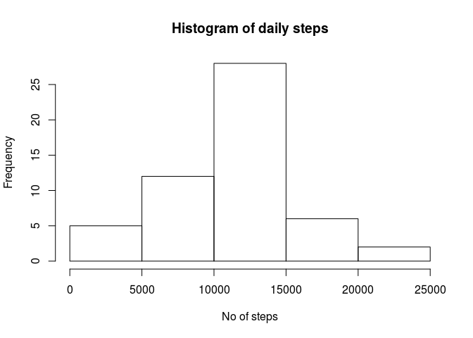
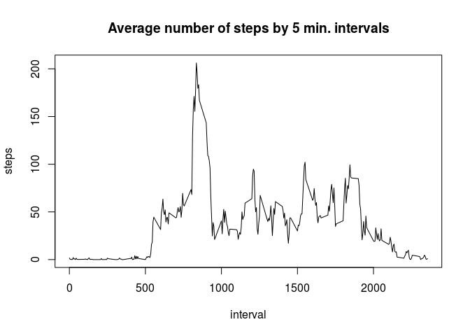
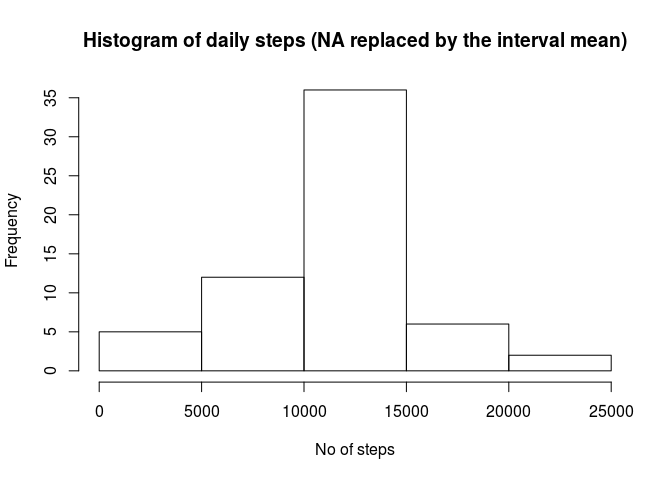
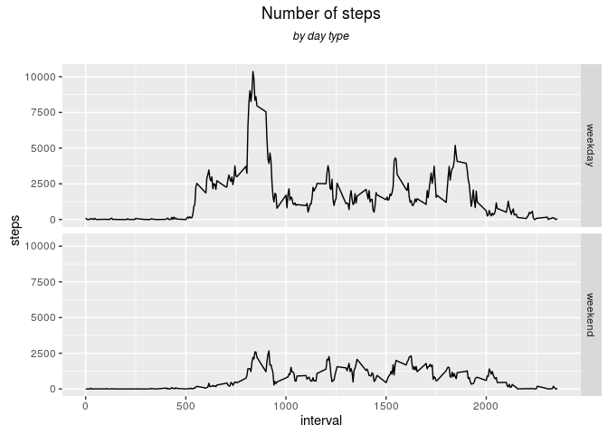

# Reproducible Research: Peer Assessment 1
Slawek  
25 August 2016  


## Source of data
Data were collected by personal movement using activity monitoring devices. The data were collected  at 5 minute intervals through out the day. 

The data consists of two months of data from an anonymous individual collected during the months of October and November, 2012 and include the number of steps taken in 5 minute intervals each day.

## Loading and preprocessing the data

Loading data set.


```r
data_clas <- c("numeric", "character", "numeric")
datafr <- read.csv("activity.csv", colClasses=data_clas, stringsAsFactors=FALSE)
datafr <- na.omit(datafr)
```

Loading necessary libraries.


```r
library (dplyr)
```

```
## 
## Attaching package: 'dplyr'
```

```
## The following objects are masked from 'package:stats':
## 
##     filter, lag
```

```
## The following objects are masked from 'package:base':
## 
##     intersect, setdiff, setequal, union
```

```r
library (ggplot2)
```

## What is mean total number of steps taken per day?

Calculating the total number of steps taken per day.

```r
temp<-aggregate (steps~date, data=datafr, FUN="sum") #aggregation of data by date
avg_steps<- sum (temp$steps)/ dim (temp)[1] #To make it a little bit complex ;)
print(paste("Mean: ", avg_steps))
```

```
## [1] "Mean:  10766.1886792453"
```

```r
print(paste("Median: ", median (temp$steps)))
```

```
## [1] "Median:  10765"
```

A histogram of the total number of steps taken each day.


```r
hist (temp$steps, main = paste("Histogram of daily steps"), xlab="No of steps")
```

<!-- -->

## What is the average daily activity pattern?

Time series plot of the 5-minute interval and the average number of steps taken, averaged across all days.


```r
temp_i<-aggregate (steps~interval, data=datafr, FUN="mean")
with (temp_i, plot(interval, steps, type = "l", xlab = "interval", ylab = "steps", main="Average number of steps by 5 min. intervals"))
```

<!-- -->


Which 5-minute interval, on average across all the days in the dataset, contains the maximum number of steps?


```r
temp [temp$steps==max (temp$steps), ]
```

```
##          date steps
## 47 2012-11-23 21194
```

## Imputing missing values

Calculating the total number of missing values in the dataset.


```r
datafr <- read.csv("activity.csv", colClasses=data_clas, stringsAsFactors=FALSE)  #reload data
dim(datafr[is.na(datafr$steps)==T,])[1]
```

```
## [1] 2304
```

A strategy for filling in all of the missing values in the dataset. Creating a new dataset that is equal to the original dataset but with the missing data filled in.

*NA values are filled with the mean for the 5-minute intervals for the whole period of the research. Additional data frame was created (table-intervals) to hold mean values of intervals. Finally NA values are filled by a function that seeks mean interval values within table-intervals (and calculates row index based on the interval value)*


```r
table_intervals <- aggregate (steps~interval, datafr, FUN="mean")
temp1<-datafr
#below line just for checking purposes
#temp1<-mutate (temp1, isna=is.na(temp1$steps)) 
#A new dataset created
temp1[is.na(temp1$steps),]$steps<-table_intervals[((temp1[is.na(temp1$steps),]$interval-40*floor(temp1[is.na(temp1$steps),]$interval/100))/5+1),]$steps
```


A histogram of the total number of steps taken each day. Calculating the mean and median total number of steps taken per day. 


```r
temp2 <- aggregate (steps~date, temp1, FUN="sum") #aggregation of data by date
print(paste("Mean: ", mean (temp2$steps)))
```

```
## [1] "Mean:  10766.1886792453"
```

```r
print(paste("Median: ", median (temp2$steps)))
```

```
## [1] "Median:  10766.1886792453"
```


```r
hist (temp2$steps, main = paste("Histogram of daily steps (NA replaced by the interval mean)"), xlab="No of steps")
```

<!-- -->

Explanation:
*Mean does not differ from the original data sets when filling missing values with a mean for each interval separately. The median value has slightly changed. 
Histogram shows higher frequency for steps in the centre.* 

## Are there differences in activity patterns between weekdays and weekends?

Creating a new factor variable in the dataset with two levels – “weekday” and “weekend” indicating whether a given date is a weekday or weekend day.

*I have used lubridate package and wday function that returns numeric class instead of weekdays functions returning character class.*


```r
library (lubridate)
```

```
## 
## Attaching package: 'lubridate'
```

```
## The following object is masked from 'package:base':
## 
##     date
```

```r
temp1<-mutate (temp1, day=wday(as.POSIXlt(date)))
temp1<-mutate (temp1, wday="weekday")
temp1[(temp1$day==1 | temp1$day==7),]$wday<-paste("weekend")
```

A panel plot containing a time series plot of the 5-minute interval (x-axis) and the average number of steps taken, averaged across all weekday days or weekend days.


```r
temp4 <- aggregate (steps~interval+wday, temp1, FUN="sum") 
#aggregation of data by weekday /weekend day and interval
dayplot<-ggplot(temp4, aes(x=interval, y=steps), col="red") + geom_line() + facet_grid(wday~.) + 
  ggtitle(expression(atop("Number of steps", atop(italic("by day type"), ""))))
dayplot
```

<!-- -->
